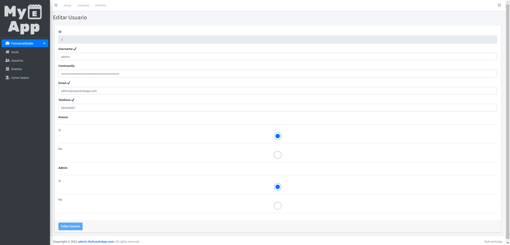
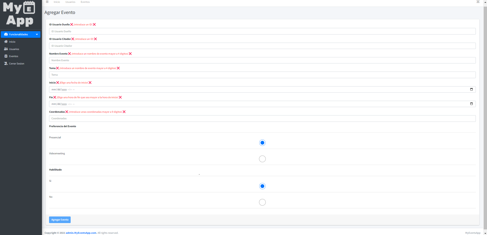

#### CICLO FORMATIVO DE GRADO SUPERIOR

### DESARROLLO DE APLICACIONES MULTIPLATAFORMA

##### ACCESO A DATOS - 2º CURSO

# AppEventos

###### Curso: 2021/22

###### AUTOR: Mario Parrilla Maroto

------

# Introducción

## Motivación y objetivos

He decidido realizar una aplicacion de eventos para dar solucion a las personas que quieres quedar o pedir cita para un evento o situacion, como por ejemplo realizar una reunión, quedar alguien para contratarle...

## Descripción de la aplicación

Esta aplicacion, te permitirá controlar los usuarios de la aplicacion movil y poder ver los eventos y sus detalles

# Especificación de requisitos

## Requisitos funcionales CMS

RQ1 - Login: El administrador se deberá logear antes de poder entrar a las funcionalidades. Según quiera, el adminitrador podrá administrar usuarios o eventos

RQ2 - Gestión Usuarios: Se podrá administrar usuarios, donde podras ver su información, editar su información, añadir usuarios y eliminar usuarios

RQ3 - Gestión Eventos: Se podrá administrar citas o eventos, podras ver su información, editar su información, añadir usuarios y eliminar eventos

Diagrama Casos de Uso:

## Wireframe

Página Inicio Sin Logearse:
En esta pagina se podrá ver el inicio y ir a la pagina de login.

Página Login:
En esta pagina podremos logearnos con nuestro usuario admin y guardar sesion.

Página Inicio Con Login:
Una vez logeados, podremos ver más opciones como usuarios, eventos y cerrar sesion.

Página Usuarios:
No mostrará una tabla donde podremos ver la información de los usuarios y las acciones como añadir, editar y eliminar usuarios.

Página Agregar Usuario:
En esta página podremos agregar un nuevo usuario incluyendo su información.

Página Modificar Usuario:
En esta página, podremos editar la información del usuario.

Página Eventos:
No mostrará una tabla donde podremos ver la información de los eventos y las acciones como añadir, editar y eliminar eventos.

Página Agregar Evento:
En esta página podremos agregar un nuevo evento incluyendo su información.

Página Modificar Evento:
En esta página, podremos editar la información del evento.

Página Errores:
Esta página se mostrará cuando ocurra cualquier error con la página.

## API REST

Describe los servicios, sus parámetros y el formato json de respuesta.

## Requisitos no funcionales

Seguridad: se necesitará un token para acceder a la api

Conectividad: se necesitará conexión wifi para poder funcionar, con http

Dispositivos: se podrá usar desde cualquier dispositivo con un navegador web

# Análisis Funcional

## Interfaz gráfico

Página Inicio Sin Logearse:
En esta pagina se podrá ver el inicio y ir a la pagina de login.

Página Login:
En esta pagina podremos logearnos con nuestro usuario admin y guardar sesion.

Página Inicio Con Login:
Una vez logeados, podremos ver más opciones como usuarios, eventos y cerrar sesion.

Página Usuarios:
No mostrará una tabla donde podremos ver la información de los usuarios y las acciones como añadir, editar y eliminar usuarios.

Página Agregar Usuario:
En esta página podremos agregar un nuevo usuario incluyendo su información.

Página Modificar Usuario:
En esta página, podremos editar la información del usuario.

Página Eventos:
No mostrará una tabla donde podremos ver la información de los eventos y las acciones como añadir, editar y eliminar eventos.

Página Agregar Evento:
En esta página podremos agregar un nuevo evento incluyendo su información.

Página Modificar Evento:
En esta página, podremos editar la información del evento.

Página Errores:
Esta página se mostrará cuando ocurra cualquier error con la página.

## Diagrama de clases

Se debe incluir un diagrama de clases, la descripción de las mismas.

## Diagrama E/R

Describe las tablas de la base de datos local e incluye un diagrama Entidad/Relación.

## Plan de pruebas

Define los casos de prueba que se deben realizar para comprobar el correcto funcionamiento de la aplicación web.

# Diseño Técnico

## Diagrama de paquetes y de componentes

Se debe incluir un diagrama de paquetes, de componentes, etc.

También se puede incluir la estructura y descripción de los ficheros que forman parte del proyecto. Descripción 

de algoritmos, etc.

## Arquitectura del sistema

Describir la arquitectura del sistema (diagrama de despliegue).

## Entorno de desarrollo, librerías y servicios

En este punto se explicarán las diferentes tecnologías utilizadas para la realización del proyecto, así como los elementos más importantes que permitan entender el funcionamiento del sistema.

## Instrucciones para la compilación, ejecución y despliegue de la aplicación

Describe los pasos a seguir para poder compilar el proyecto y ejecutarlo.

# Informe de pruebas

Describe el resultado de ejecutar los casos de prueba sobre la aplicación web y del API REST.

# Conclusiones

## Conocimientos adquiridos

Reflexiona sobre el trabajo realizado durante el desarrollo de la aplicación web y sobre los conocimientos adquiridos, problemas encontrados, etc.

## Mejoras futuras

Incluye aspectos y nueva funcionalidad que incluirías en el CMS en un futuro próximo. 