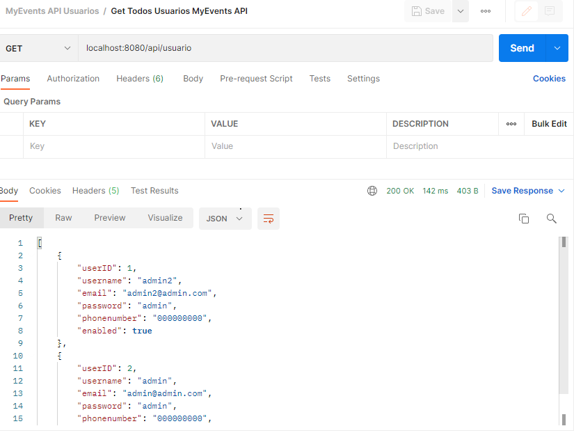
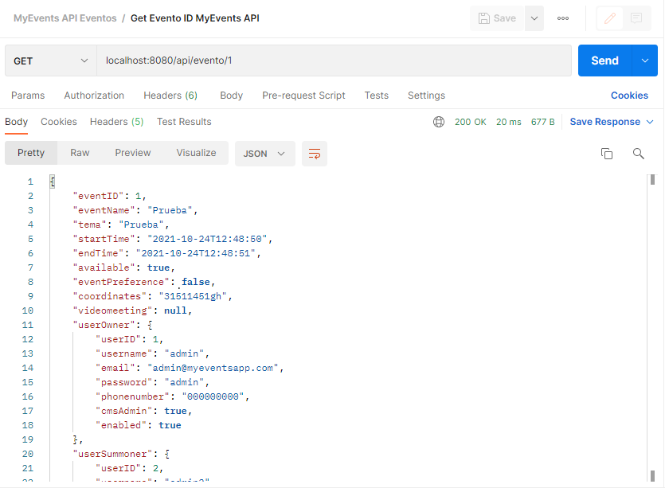
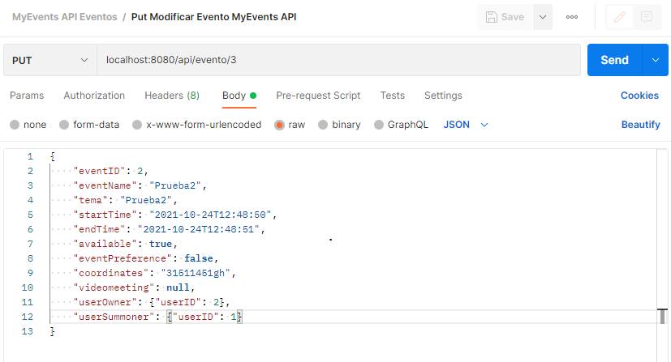

#### CICLO FORMATIVO DE GRADO SUPERIOR

### DESARROLLO DE APLICACIONES MULTIPLATAFORMA

##### ACCESO A DATOS - 2º CURSO

# AppEventos

###### Curso: 2021/22

###### AUTOR: Mario Parrilla Maroto

------

# Introducción

## Motivación y objetivos

He decidido realizar una aplicacion de eventos para dar solucion a las personas que quieres quedar o pedir cita para un evento o situacion, como por ejemplo realizar una reunión, quedar alguien para contratarle...

## Descripción de la aplicación

Esta aplicacion, te permitirá controlar los usuarios de la aplicacion movil y poder ver los eventos y sus detalles

# Especificación de requisitos

## Requisitos funcionales CMS

RQ1 - Login: El administrador se deberá logear antes de poder entrar a las funcionalidades. Según quiera, el adminitrador podrá administrar usuarios o eventos

RQ2 - Gestión Usuarios: Se podrá administrar usuarios, donde podras ver su información, editar su información, añadir usuarios y eliminar usuarios

RQ3 - Gestión Eventos: Se podrá administrar citas o eventos, podras ver su información, editar su información, añadir usuarios y eliminar eventos

Diagrama Casos de Uso:

## Wireframe

Página Inicio Sin Logearse:
En esta pagina se podrá ver el inicio y ir a la pagina de login.

Página Login:
En esta pagina podremos logearnos con nuestro usuario admin y guardar sesion.

Página Inicio Con Login:
Una vez logeados, podremos ver más opciones como usuarios, eventos y cerrar sesion.

Página Usuarios:
No mostrará una tabla donde podremos ver la información de los usuarios y las acciones como añadir, editar y eliminar usuarios.

Página Agregar Usuario:
En esta página podremos agregar un nuevo usuario incluyendo su información.

Página Modificar Usuario:
En esta página, podremos editar la información del usuario.

Página Eventos:
No mostrará una tabla donde podremos ver la información de los eventos y las acciones como añadir, editar y eliminar eventos.

Página Agregar Evento:
En esta página podremos agregar un nuevo evento incluyendo su información.

Página Modificar Evento:
En esta página, podremos editar la información del evento.

Página Errores:
Esta página se mostrará cuando ocurra cualquier error con la página.

## API REST

### API REST -- USUARIOS

Obtener todos los usuarios: Usando el metodo GET, podremos obtener todos los datos de los usuarios desde la ruta /api/usuario

Obtener un usuario: Usando el metodo GET, podremos obtener todos los datos de un usuario desde la ruta /api/usuario/{userID}

Crear un usuario: Usando el metodo POST, podremos crear un usuario desde la ruta /api/usuario con el body que se ve en la imagen. (Todos los valores del body son obligatorios NotNull)

Modificar un usuario: Usando el metodo PUT, podremos modificar a un usuario desde la ruta /api/usuario/{userID} con el body indicado en la imagen. (Todos los valores del body son obligatorios NotNull)

Eliminar un usuario: Usando el metodo DELETE, podremos eliminar a un usuario desde la ruta /api/usuario/{userID}

### API REST -- EVENTOS

Obtener todos los eventos: Usando el metodo GET, podremos obtener todos datos de los eventos desde la ruta /api/evento

Obtener un evento: Usando el metodo GET, podremos obtener todos los datos de un evento desde la ruta /api/evento/{eventID}

Crear un evento: Usando el metodo POST, podremos crear un evento desde la ruta /api/evento con el body que se ve en la imagen. (Todos los valores del body son obligatorios NotNull)

Modificar un evento: Usando el metodo PUT, podremos modificar un evento desde la ruta /api/evento/{userID} con el body indicado en la imagen. (Todos los valores del body son obligatorios NotNull)

Eliminar un evento: Usando el metodo DELETE, podremos eliminar un evento desde la ruta /api/evento/{eventID}

## Requisitos no funcionales

Seguridad: se necesitará un token para acceder a la api

Conectividad: se necesitará conexión wifi para poder funcionar, con http

Dispositivos: se podrá usar desde cualquier dispositivo con un navegador web

# Análisis Funcional

## Interfaz gráfico

Página Login:
En esta pagina podremos logearnos con nuestro usuario admin y guardar sesion.

Página Inicio Con Login:
Una vez logeados, podremos ver más opciones como usuarios, eventos y cerrar sesion.

Página Usuarios:
No mostrará una tabla donde podremos ver la información de los usuarios y las acciones como añadir, editar y eliminar usuarios.

Página Agregar Usuario:
En esta página podremos agregar un nuevo usuario incluyendo su información.

Página Modificar Usuario:
En esta página, podremos editar la información del usuario.

Página Eventos:
No mostrará una tabla donde podremos ver la información de los eventos y las acciones como añadir, editar y eliminar eventos.

Página Agregar Evento:
En esta página podremos agregar un nuevo evento incluyendo su información.

Página Modificar Evento:
En esta página, podremos editar la información del evento.

Página Errores:
Esta página se mostrará cuando ocurra cualquier error con la página.

## Diagrama de clases

Clase ServerEventosApplication: Esta clase contiene el main del spring boot.

Clase InfoMensaje: Esta clase se utliza para guardar información de mensajes que se quieran mostrar en el CMS como comunicar algun error.

Clase Evento: Esta clase almacena la información de cada evento que haya en nuestro CMS.

Clase Usuario: Esta clase almacena la información de cada usuario del CMS.

Clase ControladorIndex: Esta clase es el controlador principal, el cual responde a las llamadas a /login.

Clase ControladorError: Esta clase, responde a las llamadas a /error para mostrar paginas de errores.

Clase ControladorIndexFull: Esta clase es el controlador donde se maneja las llamadas al menu principal, a cerrar sesion y a soporte.

Clase ControladorUsuario: Esta clase es el controlador donde realizaremos el CRUD para los usuarios desde el CMS.

Clase ControladorUsuarioAPI: Esta clase es el controlador donde la aplicación movil realizará las llamadas para realizar el CRUD de los usuarios.

Clase ControladorEventos: Esta clase es el controlador donde realizaremos el CRUD para los eventos desde el CMS.

Clase ControladorControladorEventosAPI: Esta clase es el controlador donde la aplicación movil realizará las llamadas para realizar el CRUD de los eventos.

Clase EventRepository: Esta clase extiende de JpaRepository la cual tiene funciones para realizar las querys para los eventos.

Clase UserRepository: Esta clase extiende de JpaRepository la cual tiene funciones para realizar las querys para los usuarios.

Clase SecurityConfig: Esta clase es la que se encarga de manejar el acceso a los recursos de nuestro CMS y de encriptar las contraseñas de los usuarios.

DetallesUsuariosService: Esta clase se encarga de ver el rol de los usuarios para permitir accesos o no en el CMS.

JWTService: Esta clase es la que se encarga de verificar los tokens que limitan el acceso a nuestras API's del CMS.

## Diagrama E/R

### TABLA -- USUARIO

Todos los datos de esta tabla son Not Null, no pueden ser nulos

userID: Es la clave principal de la tabla, que será el identificador del usuario, que es de tipo bigint.

username: Es el nombre de usuario, que es de tipo varchar.

email: Es el correo electronico del usuario, que es de tipo varchar.

password: Es la contraseña del usuario, que es de tipo varchar.

phonenumber: Es el numero de telefono del usuario, que es de tipo varchar.

enabled: Nos servirá para saber si el usuario puede utilizarse o no, que es de tipo bit que en verdad es un boolean.

### TABLA -- EVENTO

eventID: Es la clave principal de la tabla, que será el identificador del evento, que es de tipo bigint. NotNull.

eventname: Es el nombre de evento, que es de tipo varchar. NotNull.

eventname: Es el tema del evento, que es de tipo varchar. NotNull.

start_time: Es la fecha y hora del inicio del evento, que es de tipo Datetime. NotNull.

end_time: Es la fecha y hora de final del evento, que es de tipo Datetime. NotNull.

event_preference: Con este dato, segun su valor, si es 0 será un evento presencial y si no, será un evento meeting y con esto trabajaremos con diferentes datos según este valor, es de tipo bit, que en realidad es un boolean. NotNull.

coordinates: Son las coordenadas de la localizacion del lugar de quedada del evento, es de tipo varchar.

videomeeting: Es el enlace de la videoconferencia del evento, es de tipo varchar.

available: Con este dato sabremos si el evento esta activado o no según su valor (0 = desahabilitado / 1 = habilitado), es de tipo bit, pero en realidad es de tipo boolean. NotNull.

user_owner_id_user: es la id del usuario que ha creado el evento, es de tipo bigint. NotNull.

user_summoner_id_user: es la id del usuario que ha citado al creador el evento, es de tipo bigint.

## Plan de pruebas

Prueba 1: Comprobar Existencia del un Usuario en el login: Se pasaran como parametros un usuario y una contraseña y si el usuario existe, nos devolverá un true, si no, nos devolverá false.

Prueba 2: Comprobar usuario agregado: Se pasará un objeto usuario y si el usuario se agrega correctamente, nos devolverá un true, si no, nos devolverá un flase.

🏗️⚠️PLAN DE PRUEBAS EN DESARROLLO⚠️🏗️

# Diseño Técnico

## Diagrama de paquetes y de componentes

Paquete Controladores: En este paquete se almacenan las clases que se encargan del redericcionar a las vistas segun se solicite.

Paquete Entity: En este paquete se almacenan las clases de los objetos que almacenamos en la bd y otros objetos.

Paquete Repository: En este paquete se almacenan las clases que se encargan de realizar las querys.

Paquete services: En este paquete se almacenan las clases donde almacenamos funcionalidades complejas como la logica de JWT.

Paquete security: En este paquete se almacenan las clases se encargan de mantener el CMS seguro.

Paquete resources: En este paquete se almacena los recursos como las vistas html y archivos estaticos como css, js o imagenes.

## Arquitectura del sistema

CMS:  El CMS esta desplegado en la plataforma de Heroku. Este CMS esta desarrollado con Spring boot.

MyEventsApp: Esta es la aplicación android desarrolladoa con java.

Navegador: Se trata de un cliente web como chrome, firefox... 

Base de datos: La base de datos esta hosteada en amazon ya que se utiliza un plugin en heroku que te la hostea ahí.

## Entorno de desarrollo, librerías y servicios

Spring-Boot: Este es el framework que he utilizado para desarrollar el cms, el cual permite crear facilmente un servidor web.

Thymeleaf: Es el motor de plantillas java que he utilizado para renderizar mi html y que sea dinamico con los datos del cms.

JWT: Esta es la tecnologia que he utlizado para realizar un api rest seguro y con uso limitado a mi aplicación android. Se trata de un web token encriptado.

Base de datos: Se utliza una base de datos relacional, MySQL.

Hibernate: Spring-boot, permite la generación de base de datos relacionales con JPA, a traves de esta tecnologia.

Spring-Boot Security: Es parte de spring-boot, y nos permite limitar el uso de los recursos de nuestro CMS según como lo configuemos entre otras muchas cosas.

BCrypt: Esta es la tecnologia que utiliza Spring boot security para poder encriptar las contraseñas de los usuarios para hacer la plataforma más segura.

## Instrucciones para la compilación, ejecución y despliegue de la aplicación

Se deberá tener java 1.8 en el dispositivo además de conexion a internet, ademas de maven y spring boot.

Puedes cambiar la direccion de la base de datos en:

# Informe de pruebas

<figure class="video_container">
    <a href="https://youtu.be/B3BruBbosVo">Video</a>
</figure>

# Conclusiones

## Conocimientos adquiridos

Reflexiona sobre el trabajo realizado durante el desarrollo de la aplicación web y sobre los conocimientos adquiridos, problemas encontrados, etc.

Gracias a este trabajo he aprendido a como utilizar el framework spring boot y crear con este un CMS con sus respectivos controladores, su respectivdad seguridad, ademas se aprender a crear una api y como funciona. Ademas, he aprendido a utilizar los tokens web como JWT. También, he aprendido en que consiste un ORM como hibernate y como gracias a este podemos crear base de datos relacionales con instrucciones JPA.
En el desarrollo del CMS no me he encontrado ningún error que me haya complicado el desarrollo.

En conclusión, gracias a esta practica, he aprendido muchos conceptos a la hora de crear un CMS y sus funciones y a empezar a entender el desarrollo con el framework spring  boot.

## Mejoras futuras

- Mejorar visualmente en algunos aspectos.

- Añadir más graficos.