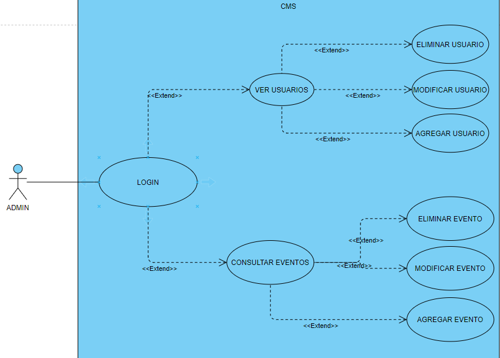

#### CICLO FORMATIVO DE GRADO SUPERIOR

### DESARROLLO DE APLICACIONES MULTIPLATAFORMA

##### ACCESO A DATOS - 2º CURSO

# AppEventos

###### Curso: 2021/22

###### AUTOR: Mario Parrilla Maroto

------

# Introducción

## Motivación y objetivos

He decidido realizar una aplicacion de eventos para dar solucion a las personas que quieres quedar o pedir cita para un evento o situacion, como por ejemplo realizar una reunión, quedar alguien para contratarle...

## Descripción de la aplicación

Esta aplicacion, te permitirá controlar los usuarios de la aplicacion movil y poder ver los eventos y sus detalles

# Especificación de requisitos

## Requisitos funcionales CMS

El administrador se deberá logear antes de poder entrar a las funcionalidades. Según quiera, el adminitrador podrá administrar usuarios o eventos

Administrar usuarios, donde podras ver su información, editar su información, añadir usuarios y eliminar usuarios

Administrar citas o eventos, podras ver su información, editar su información, añadir usuarios y eliminar eventos

Diagrama Casos de Uso:

## Wireframe

Incluye un boceto y la descripción de cada una de las pantallas de la aplicación

## API REST

Describe los servicios, sus parámetros y el formato json de respuesta.

## Requisitos no funcionales

Describe todos los requisitos no funcionales que se deben tener en cuenta para el desarrollo de la aplicación (seguridad, conectividad, tipos de dispositivos, memoria, procesador, espacio de almacenamiento, etc.)

# Análisis Funcional

## Interfaz gráfico

Incluye las imágenes con el diseño de las pantallas y cualquier descripción o comentario que creas conveniente.

## Diagrama de clases

Se debe incluir un diagrama de clases, la descripción de las mismas.

## Diagrama E/R

Describe las tablas de la base de datos local e incluye un diagrama Entidad/Relación.

## Plan de pruebas

Define los casos de prueba que se deben realizar para comprobar el correcto funcionamiento de la aplicación web.

# Diseño Técnico

## Diagrama de paquetes y de componentes

Se debe incluir un diagrama de paquetes, de componentes, etc.

También se puede incluir la estructura y descripción de los ficheros que forman parte del proyecto. Descripción 

de algoritmos, etc.

## Arquitectura del sistema

Describir la arquitectura del sistema (diagrama de despliegue).

## Entorno de desarrollo, librerías y servicios

En este punto se explicarán las diferentes tecnologías utilizadas para la realización del proyecto, así como los elementos más importantes que permitan entender el funcionamiento del sistema.

## Instrucciones para la compilación, ejecución y despliegue de la aplicación

Describe los pasos a seguir para poder compilar el proyecto y ejecutarlo.

# Informe de pruebas

Describe el resultado de ejecutar los casos de prueba sobre la aplicación web y del API REST.

# Conclusiones

## Conocimientos adquiridos

Reflexiona sobre el trabajo realizado durante el desarrollo de la aplicación web y sobre los conocimientos adquiridos, problemas encontrados, etc.

## Mejoras futuras

Incluye aspectos y nueva funcionalidad que incluirías en el CMS en un futuro próximo. 