#### CICLO FORMATIVO DE GRADO SUPERIOR

### DESARROLLO DE APLICACIONES MULTIPLATAFORMA

##### ACCESO A DATOS - 2º CURSO

# AppEventos

###### Curso: 2021/22

###### AUTOR: Mario Parrilla Maroto

------

# Introducción

## Motivación y objetivos

He decidido realizar una aplicacion de eventos para dar solucion a las personas que quieres quedar o pedir cita para un evento o situacion, como por ejemplo realizar una reunión, quedar alguien para contratarle...

## Descripción de la aplicación

Esta aplicacion, te permitirá controlar los usuarios de la aplicacion movil y poder ver los eventos y sus detalles

# Especificación de requisitos

## Requisitos funcionales CMS

RQ1 - Login: El administrador se deberá logear antes de poder entrar a las funcionalidades. Según quiera, el adminitrador podrá administrar usuarios o eventos

RQ2 - Gestión Usuarios: Se podrá administrar usuarios, donde podras ver su información, editar su información, añadir usuarios y eliminar usuarios

RQ3 - Gestión Eventos: Se podrá administrar citas o eventos, podras ver su información, editar su información, añadir usuarios y eliminar eventos

Diagrama Casos de Uso:

## Wireframe

Página Inicio Sin Logearse:
En esta pagina se podrá ver el inicio y ir a la pagina de login.

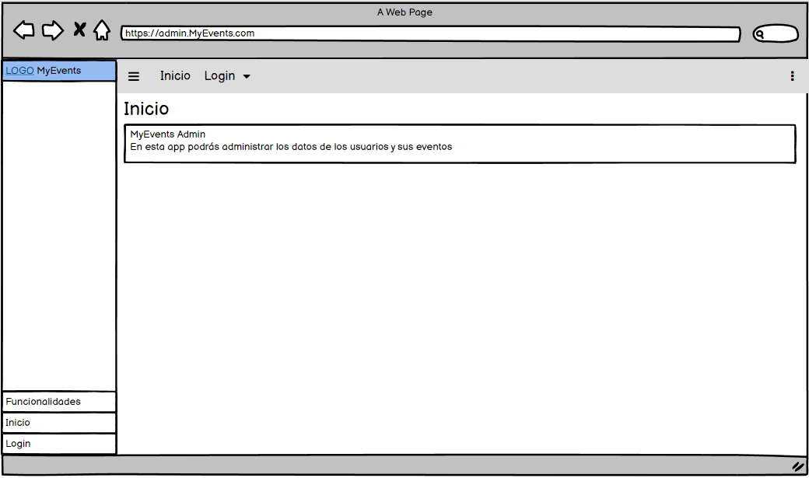

Página Login:
En esta pagina podremos logearnos con nuestro usuario admin y guardar sesion.

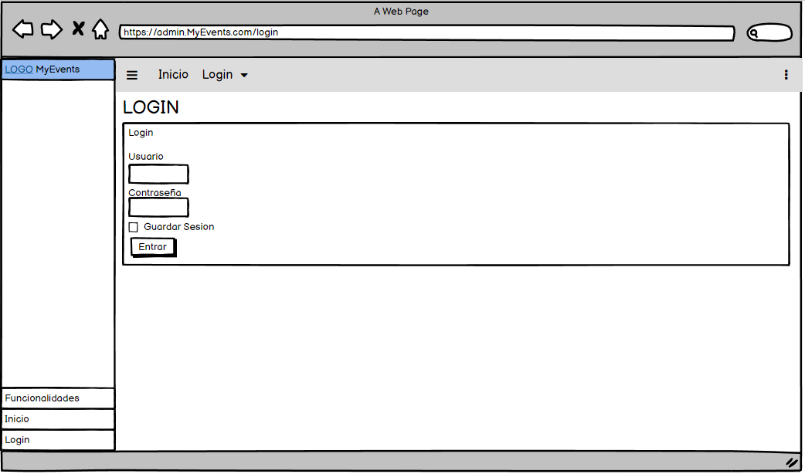

Página Inicio Con Login:
Una vez logeados, podremos ver más opciones como usuarios, eventos y cerrar sesion.

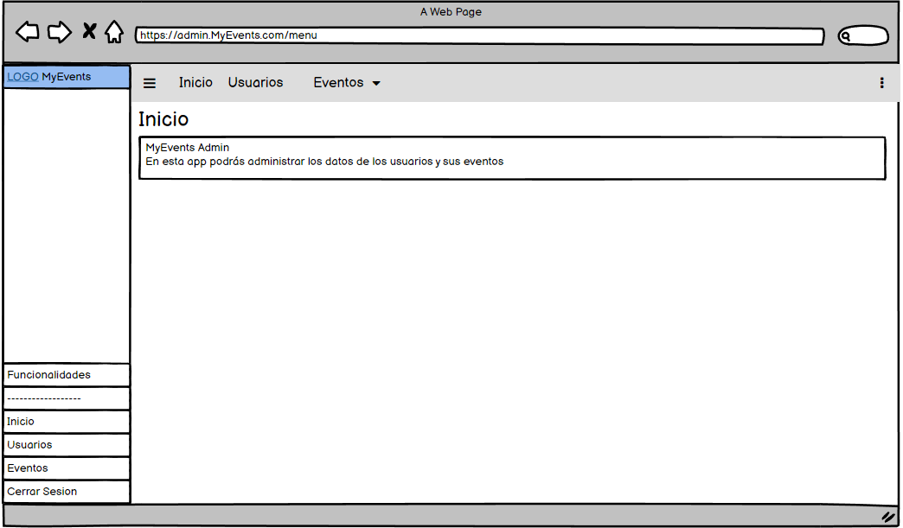

Página Usuarios:
No mostrará una tabla donde podremos ver la información de los usuarios y las acciones como añadir, editar y eliminar usuarios.

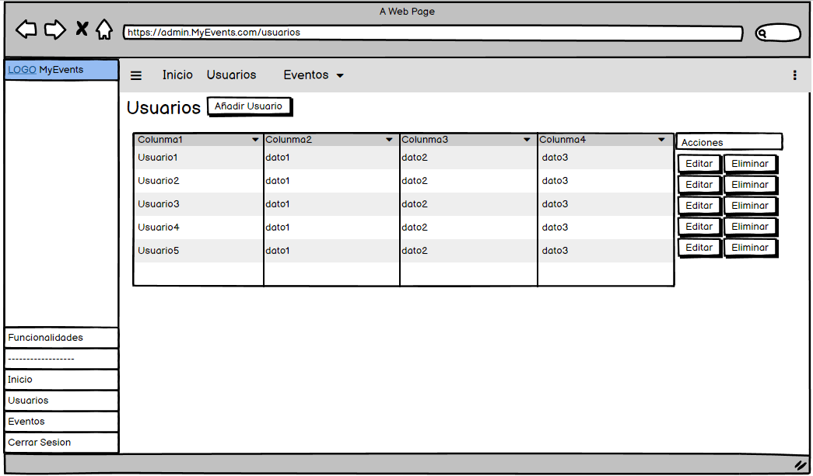

Página Agregar Usuario:
En esta página podremos agregar un nuevo usuario incluyendo su información.

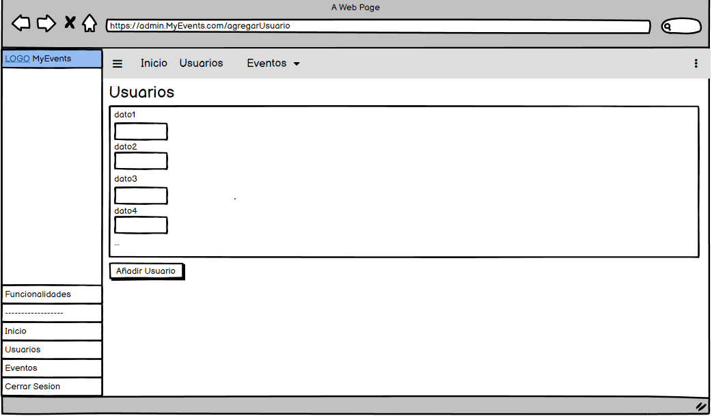

Página Modificar Usuario:
En esta página, podremos editar la información del usuario.

Página Eventos:
No mostrará una tabla donde podremos ver la información de los eventos y las acciones como añadir, editar y eliminar eventos.

Página Agregar Evento:
En esta página podremos agregar un nuevo evento incluyendo su información.

Página Modificar Evento:
En esta página, podremos editar la información del evento.

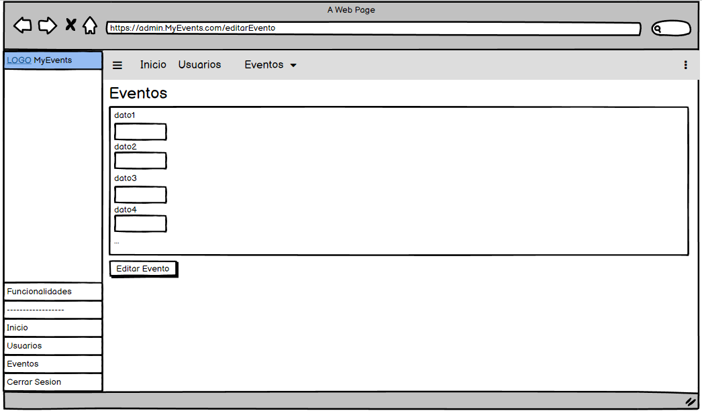

Página Errores:
Esta página se mostrará cuando ocurra cualquier error con la página.

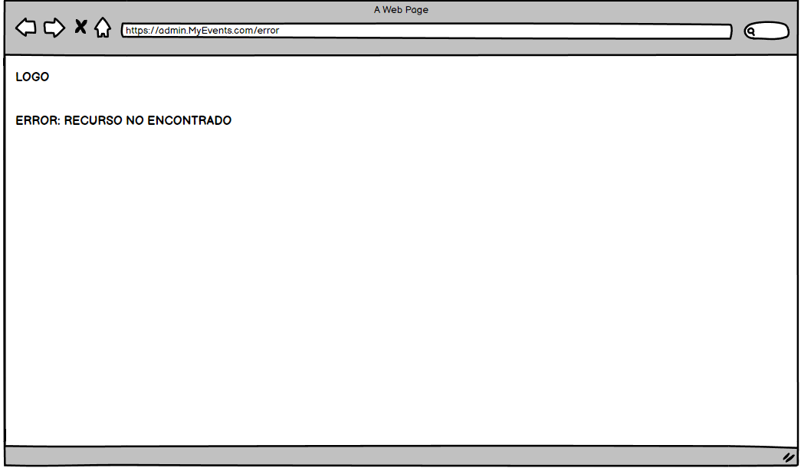

## API REST

### API REST -- USUARIOS

Obtener todos los usuarios: Usando el metodo GET, podremos obtener todos los datos de los usuarios desde la ruta /api/usuario

Obtener un usuario: Usando el metodo GET, podremos obtener todos los datos de un usuario desde la ruta /api/usuario/{userID}

Crear un usuario: Usando el metodo POST, podremos crear un usuario desde la ruta /api/usuario con el body que se ve en la imagen. (Todos los valores del body son obligatorios NotNull)

Modificar un usuario: Usando el metodo PUT, podremos modificar a un usuario desde la ruta /api/usuario/{userID} con el body indicado en la imagen. (Todos los valores del body son obligatorios NotNull)

Eliminar un usuario: Usando el metodo DELETE, podremos eliminar a un usuario desde la ruta /api/usuario/{userID}

### API REST -- EVENTOS

Obtener todos los eventos: Usando el metodo GET, podremos obtener todos datos de los eventos desde la ruta /api/evento

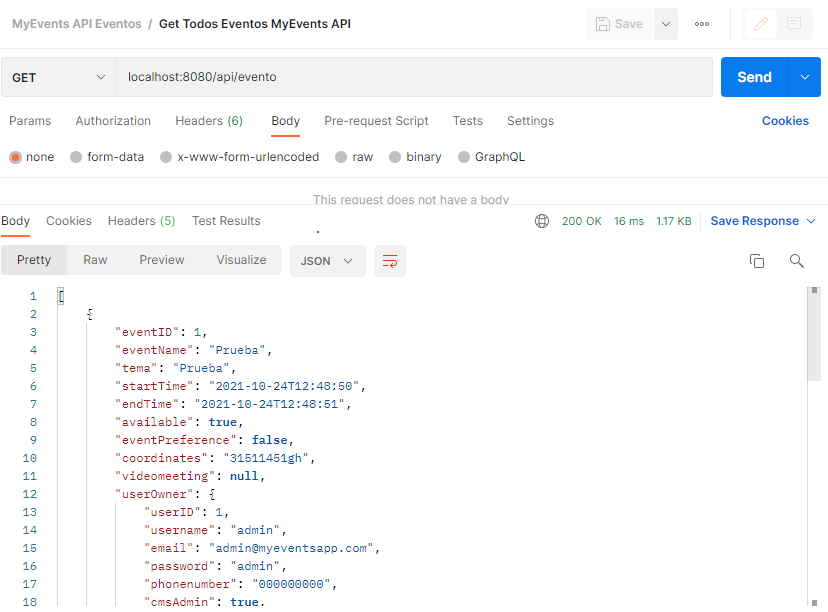

Obtener un evento: Usando el metodo GET, podremos obtener todos los datos de un evento desde la ruta /api/evento/{eventID}

Crear un evento: Usando el metodo POST, podremos crear un evento desde la ruta /api/evento con el body que se ve en la imagen. (Todos los valores del body son obligatorios NotNull)

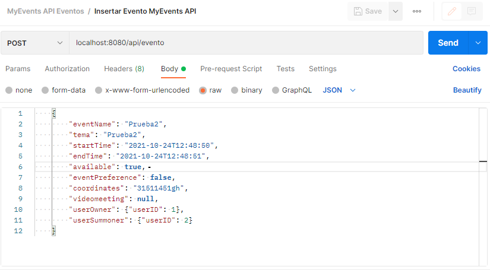

Modificar un evento: Usando el metodo PUT, podremos modificar un evento desde la ruta /api/evento/{userID} con el body indicado en la imagen. (Todos los valores del body son obligatorios NotNull)

Eliminar un evento: Usando el metodo DELETE, podremos eliminar un evento desde la ruta /api/evento/{eventID}

## Requisitos no funcionales

Seguridad: se necesitará un token para acceder a la api

Conectividad: se necesitará conexión wifi para poder funcionar, con http

Dispositivos: se podrá usar desde cualquier dispositivo con un navegador web

# Análisis Funcional

## Interfaz gráfico

Página Login:
En esta pagina podremos logearnos con nuestro usuario admin y guardar sesion.

Página Inicio Con Login:
Una vez logeados, podremos ver más opciones como usuarios, eventos y cerrar sesion.

Página Usuarios:
No mostrará una tabla donde podremos ver la información de los usuarios y las acciones como añadir, editar y eliminar usuarios.

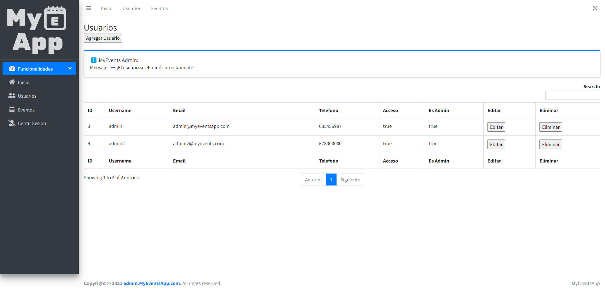

Página Agregar Usuario:
En esta página podremos agregar un nuevo usuario incluyendo su información.

Página Modificar Usuario:
En esta página, podremos editar la información del usuario.

Página Eventos:
No mostrará una tabla donde podremos ver la información de los eventos y las acciones como añadir, editar y eliminar eventos.

Página Agregar Evento:
En esta página podremos agregar un nuevo evento incluyendo su información.

Página Modificar Evento:
En esta página, podremos editar la información del evento.

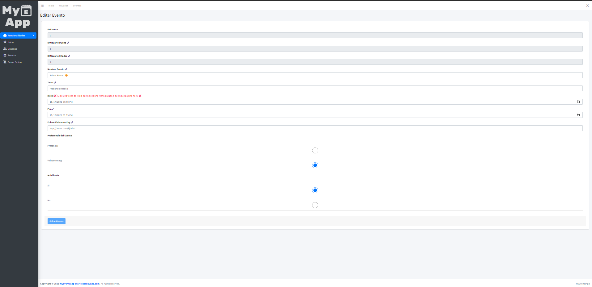

Página Errores:
Esta página se mostrará cuando ocurra cualquier error con la página.

## Diagrama de clases

Clase ServerEventosApplication: Esta clase contiene el main del spring boot.

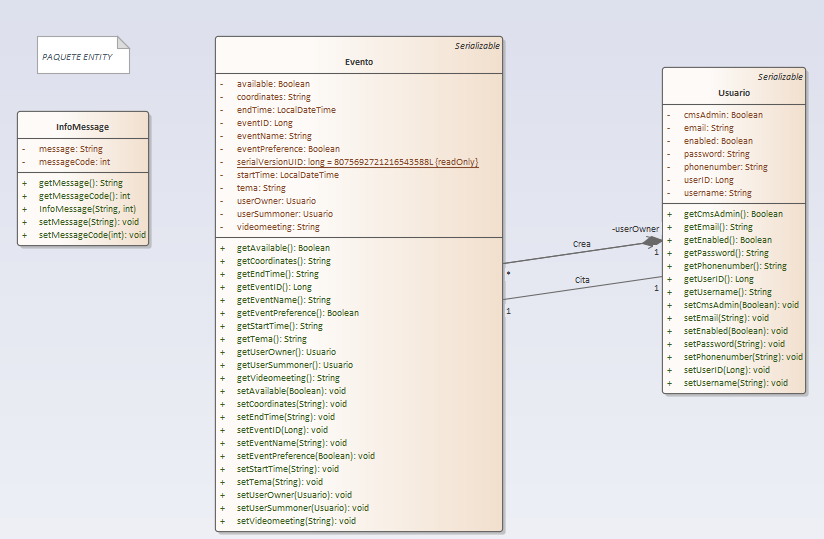

Clase InfoMensaje: Esta clase se utliza para guardar información de mensajes que se quieran mostrar en el CMS como comunicar algun error.

Clase Evento: Esta clase almacena la información de cada evento que haya en nuestro CMS.

Clase Usuario: Esta clase almacena la información de cada usuario del CMS.

Clase ControladorIndex: Esta clase es el controlador principal, el cual responde a las llamadas a /login.

Clase ControladorError: Esta clase, responde a las llamadas a /error para mostrar paginas de errores.

Clase ControladorIndexFull: Esta clase es el controlador donde se maneja las llamadas al menu principal, a cerrar sesion y a soporte.

Clase ControladorUsuario: Esta clase es el controlador donde realizaremos el CRUD para los usuarios desde el CMS.

Clase ControladorUsuarioAPI: Esta clase es el controlador donde la aplicación movil realizará las llamadas para realizar el CRUD de los usuarios.

Clase ControladorEventos: Esta clase es el controlador donde realizaremos el CRUD para los eventos desde el CMS.

Clase ControladorControladorEventosAPI: Esta clase es el controlador donde la aplicación movil realizará las llamadas para realizar el CRUD de los eventos.

Clase EventRepository: Esta clase extiende de JpaRepository la cual tiene funciones para realizar las querys para los eventos.

Clase UserRepository: Esta clase extiende de JpaRepository la cual tiene funciones para realizar las querys para los usuarios.

Clase SecurityConfig: Esta clase es la que se encarga de manejar el acceso a los recursos de nuestro CMS y de encriptar las contraseñas de los usuarios.

DetallesUsuariosService: Esta clase se encarga de ver el rol de los usuarios para permitir accesos o no en el CMS.

JWTService: Esta clase es la que se encarga de verificar los tokens que limitan el acceso a nuestras API's del CMS.

## Diagrama E/R

### TABLA -- USUARIO

Todos los datos de esta tabla son Not Null, no pueden ser nulos

userID: Es la clave principal de la tabla, que será el identificador del usuario, que es de tipo bigint.

username: Es el nombre de usuario, que es de tipo varchar.

email: Es el correo electronico del usuario, que es de tipo varchar.

password: Es la contraseña del usuario, que es de tipo varchar.

phonenumber: Es el numero de telefono del usuario, que es de tipo varchar.

enabled: Nos servirá para saber si el usuario puede utilizarse o no, que es de tipo bit que en verdad es un boolean.

### TABLA -- EVENTO

eventID: Es la clave principal de la tabla, que será el identificador del evento, que es de tipo bigint. NotNull.

eventname: Es el nombre de evento, que es de tipo varchar. NotNull.

eventname: Es el tema del evento, que es de tipo varchar. NotNull.

start_time: Es la fecha y hora del inicio del evento, que es de tipo Datetime. NotNull.

end_time: Es la fecha y hora de final del evento, que es de tipo Datetime. NotNull.

event_preference: Con este dato, segun su valor, si es 0 será un evento presencial y si no, será un evento meeting y con esto trabajaremos con diferentes datos según este valor, es de tipo bit, que en realidad es un boolean. NotNull.

coordinates: Son las coordenadas de la localizacion del lugar de quedada del evento, es de tipo varchar.

videomeeting: Es el enlace de la videoconferencia del evento, es de tipo varchar.

available: Con este dato sabremos si el evento esta activado o no según su valor (0 = desahabilitado / 1 = habilitado), es de tipo bit, pero en realidad es de tipo boolean. NotNull.

user_owner_id_user: es la id del usuario que ha creado el evento, es de tipo bigint. NotNull.

user_summoner_id_user: es la id del usuario que ha citado al creador el evento, es de tipo bigint.

## Plan de pruebas

Prueba 1: Comprobar Existencia del un Usuario en el login: Se pasaran como parametros un usuario y una contraseña y si el usuario existe, nos devolverá un true, si no, nos devolverá false.

Prueba 2: Comprobar usuario agregado: Se pasará un objeto usuario y si el usuario se agrega correctamente, nos devolverá un true, si no, nos devolverá un false.

Prueba3: Se comprobará si un evento se agrega correctamente, si se agrega, nos devolverá true, si no devolverá un false.

# Diseño Técnico

## Diagrama de paquetes y de componentes

Paquete Controladores: En este paquete se almacenan las clases que se encargan del redericcionar a las vistas segun se solicite.

Paquete Entity: En este paquete se almacenan las clases de los objetos que almacenamos en la bd y otros objetos.

Paquete Repository: En este paquete se almacenan las clases que se encargan de realizar las querys.

Paquete services: En este paquete se almacenan las clases donde almacenamos funcionalidades complejas como la logica de JWT.

Paquete security: En este paquete se almacenan las clases se encargan de mantener el CMS seguro.

Paquete resources: En este paquete se almacena los recursos como las vistas html y archivos estaticos como css, js o imagenes.

## Arquitectura del sistema

CMS:  El CMS esta desplegado en la plataforma de Heroku. Este CMS esta desarrollado con Spring boot.

MyEventsApp: Esta es la aplicación android desarrolladoa con java.

Navegador: Se trata de un cliente web como chrome, firefox... 

Base de datos: La base de datos esta hosteada en amazon ya que se utiliza un plugin en heroku que te la hostea ahí.

## Entorno de desarrollo, librerías y servicios

Spring-Boot: Este es el framework que he utilizado para desarrollar el cms, el cual permite crear facilmente un servidor web.

Thymeleaf: Es el motor de plantillas java que he utilizado para renderizar mi html y que sea dinamico con los datos del cms.

JWT: Esta es la tecnologia que he utlizado para realizar un api rest seguro y con uso limitado a mi aplicación android. Se trata de un web token encriptado.

Base de datos: Se utliza una base de datos relacional, MySQL.

Hibernate: Spring-boot, permite la generación de base de datos relacionales con JPA, a traves de esta tecnologia.

Spring-Boot Security: Es parte de spring-boot, y nos permite limitar el uso de los recursos de nuestro CMS según como lo configuemos entre otras muchas cosas.

BCrypt: Esta es la tecnologia que utiliza Spring boot security para poder encriptar las contraseñas de los usuarios para hacer la plataforma más segura.

## Instrucciones para la compilación, ejecución y despliegue de la aplicación

Para poder acceder al cms debes usar el ususario rogelio (en minusculas) con la contraseña admin

Se deberá tener java 1.8 en el dispositivo además de conexion a internet, ademas de maven y spring boot.

Puedes cambiar la direccion de la base de datos en:

# Informe de pruebas

<figure class="video_container">
    <a href="https://youtu.be/B3BruBbosVo">Video</a>
</figure>

# Conclusiones

## Conocimientos adquiridos

Reflexiona sobre el trabajo realizado durante el desarrollo de la aplicación web y sobre los conocimientos adquiridos, problemas encontrados, etc.

Gracias a este trabajo he aprendido a como utilizar el framework spring boot y crear con este un CMS con sus respectivos controladores, su respectivdad seguridad, ademas se aprender a crear una api y como funciona. Ademas, he aprendido a utilizar los tokens web como JWT. También, he aprendido en que consiste un ORM como hibernate y como gracias a este podemos crear base de datos relacionales con instrucciones JPA.
En el desarrollo del CMS no me he encontrado ningún error que me haya complicado el desarrollo.

En conclusión, gracias a esta practica, he aprendido muchos conceptos a la hora de crear un CMS y sus funciones y a empezar a entender el desarrollo con el framework spring  boot.

## Mejoras futuras

- Mejorar visualmente en algunos aspectos.

- Añadir más graficos.
